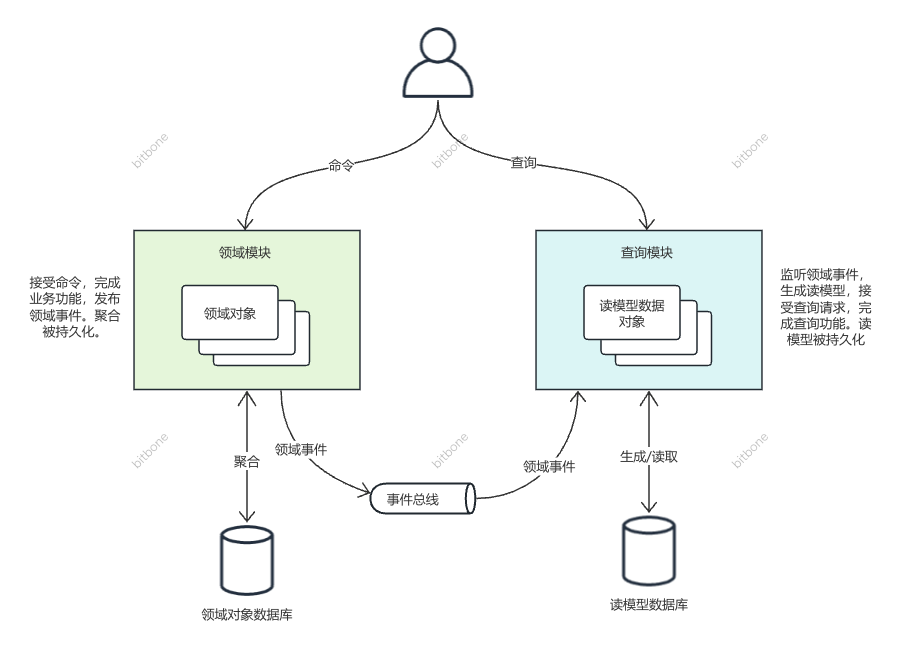

# 命令和查询职责分离(CQRS)

命令和查询职责分离，英文名 Command and Query Responsibility Segregation。这种架构风格中，把业务需求分成查询类和命令类两种，查询类不会引起业务变更，命令类会引发业务变更，在系统层面，将负责实现这两类功能的代码分拆到不同的模块里。DDD实践中使用CQRS时，让领域模型主要满足命令类的业务需求，将查询类，尤其是复杂查询类的需求交给领域模型外的读模型去单独满足。

标准的CQRS架构如下图：

## CQRS给DDD实现带来什么好处？
让领域模型不用承担复杂查询的责任，大大降低领域模型建模和实现的难度。

在典型的系统中，命令类和查询类功能存在巨大的差异。

命令类功能往往需要较少的领域对象参与其中，而且这些对象往往互相间存在协作关系，共同完成业务功能。由于这些业务功能导致领域对象发生了变更，还需要把它们再次持久化，给下次使用。

查询类的功能，只需要读取数据，转化成需要的格式，返回给用户即可。这些数据，都算不上对象，它们没有行为，被载入到内存后，互相间没有交互，也不会发生变更。 困难在于如何找到这些数据，如何高效的找到这些数据。这里涉及到查询条件的多变，数量检索的效率问题。

假如聚合同时承担上面两类责任，就面临着矛盾：
* 冗余：实现命令类功能需要尽量不冗余数据，而为了查询效率，又必须冗余一些数据
* 为了更容易实现命令类功能，聚合内相关的对象要整体读取，而为了查询效率，经常只查询部分用户关心的数据，不同角色的用户需要看到的数据还不一样
* 为了确保业务数据的一致性，命令类功能更倾向于使用数据库实现，而为了查询能力和效率，经常需要使用redis elastics-search 等等多种存储方式混合存储

因此，让聚合同时承担查询责任，是很困难的。采用CQRS，让聚合彻底不用管查询责任了，让建模和实现更容易。

## 什么情况下使用CQRS？

## 如何确保读模型一定能够通过领域事件生成出来？

## 使用事件风暴一定得用CQRS吗？

## 领域模块里要查询数据，必须得通过读模型来查询吗？

## 是不是所有的查询功能都必须用读模型？不能查询聚合来满足查询需求？

## CQRS就是读写分离？

## 必须监听领域事件异步生成读模型吗？

## 异步生成读模型，导致用户不能立刻看到变更结果怎么办？

## 如何确保读模型和领域对象的数据一致性？

## 报表类的功能算是查询类功能吗？可以用CQRS吗？

## 读模型必须和聚合对应吗？

## 线上出bug了，有一些读模型生成错了，怎么办？

## 新需要来了，要有新的读模型，如何初始化新的读模型？

## 有一个查询功能，要重用领域模块的计算逻辑，怎么办？

