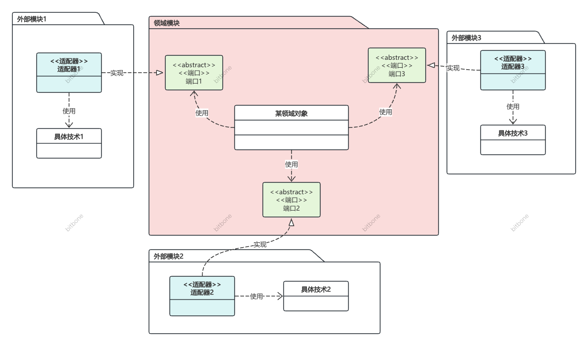

# 端口适配器(Ports-and-Adapters)
端口适配器模式，又叫六边形架构、洋葱架构、整洁架构等。端口适配器这个名字直白的表述了它的基本原理，更容易被理解，所以这里采用了这个名字。

面向对象设计里有一个原则叫依赖翻转(Dependency Inversion Principle，也翻译叫控制翻转)。端口适配器正式遵守这个原则，利用编程技巧，将领域模块居于整个架构的核心，让领域模块不依赖别的模块，而是让别的模块来依赖领域模块，服务于领域模块。

## 什么时候采用端口适配器？
建议所有项目实现领域模型的时候，都使用端口适配器。除非某些非常低级的语言不支持接口、抽象类等类似抽象机制，实现起来特别麻烦，否则都应该使用端口适配器。这个架构模式，付出的成本极小，获取的收益却很高。

## 为什么DDD要采用端口适配器架构？

### 有利于实现纯粹干净的领域模型
实现领域模型的时候遇到一个困难，即有一些功能的实现是技术性，不是业务的，如果把这些代码写到领域模块内，就会导致领域模型代码直接和某种具体技术耦合。比如最常见的就是数据库的访问，在领域模块里写sql，会导致sql污染了领域模块，但是某个功能有需要使用sql，怎么办呢？端口适配器架构给出的方案，就是在领域模块中定义一个接口（端口），用领域的语言来表达，然后在领域模块之外写一个适配器对象，它实现了这个接口，并使用了具体sql技术。然后在领域模块之外，我们将这个适配器的实例注入到需要它的领域对象中。从而实现了，即保持了领域模块里只有更纯粹的业务逻辑代码，同时能和领域模块外的具体技术相结合。

### 提升领域模型的可测试性
当领域模块不以来外部模块，领域对象最多只依赖一些接口抽象类的时候，这些依赖很容易被mock，导致领域对象变得特别容易被测试。

### 提升领域模型的可重构能力
由于领域模型的代码不依赖外部，在一个模块内做重构，变得更容易。只要保持事件、命令、端口的语义是正确的，领域模块内可以任意对领域对象做重构。同时，由于领域对象很容易被单元测试，也保证了重构的影响范围是可见的，可控的，可验证的。

### 有助于简化建模
建模的时候，尤其是对于聚合，建模者还是要盘算这个对象是否能够实现，是否容易被实现，也就是说，实际上建模的时候，多多少少会被具体实现所影响的。采用端口适配器后，领域对象可以在任何时候把具体实现通过依赖翻转的方式排除到领域模块外部，从而大大降低了对实现的担心，让建模者更专注于问题域和领域模型上。

试想，不采用端口适配器，让领域对象直接依赖具体技术，比如访问数据库、发送MQ消息等等，那么建模的时候，就很难不去思考这个功能如何用数据实现，是否方便发送MQ等等。

## 采用端口适配器，导致对象转化变多了，怎么办？
就这么办。

采用端口适配器，领域模型不会使用外部的对象，另一方面又不能把领域模型对象暴露给外部，必然导致领域模块之外，要一些把各种DTO和领域模型间转化的工作。为了获取前面说的好处，这点多出来的工作量是值得的。

多了这些转化，也是正确的实现方式。对象的职责应该单一，不应该有一个对象即承担表达给前端数据格式的责任，又承担数据库数据结构的责任，又承担领域对象的责任。就应该把这些职责分配到不同的对象上，明确各自的功能是什么。

可以通过技术手段，降低这些对象构建、转化的成本，比如采用更富有表达能力的程序语言，某些代码生成框架等。

