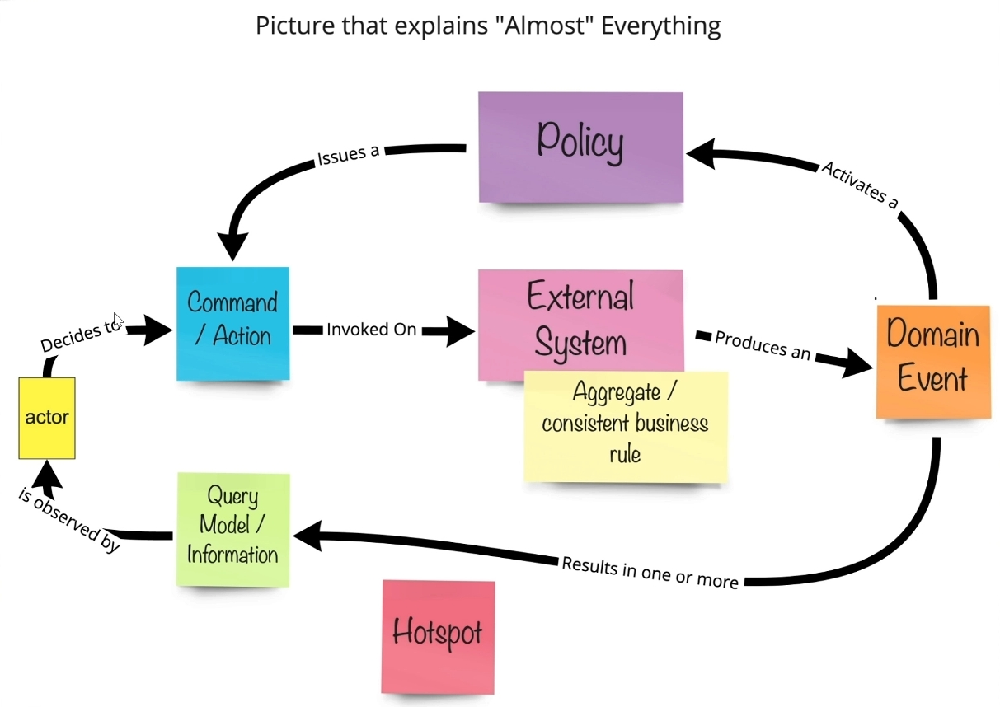
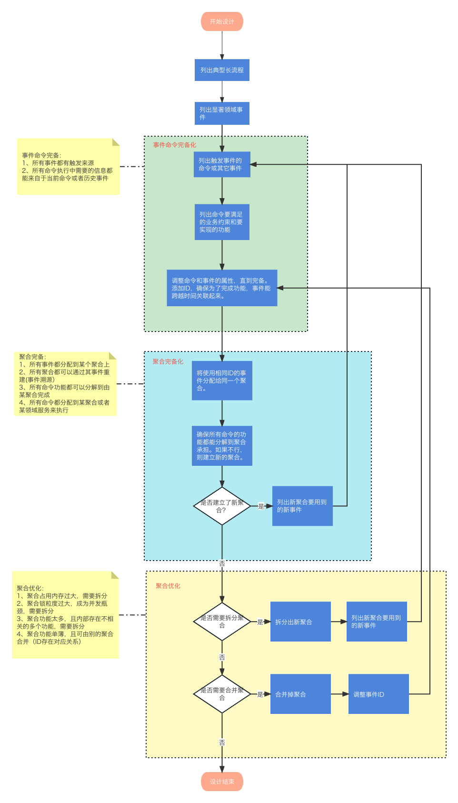

# 事件风暴

## 什么是事件风暴？

事件风暴（Event storming）是利用研讨方式，快速发现软件特定领域中所发生事物的作法。和其他方式比较，此方式相当的简单，而且过程不需要电脑协助，活动只需要便利贴以及宽阔的墙面。在此活动中，商业流程会变成一连串的领域事件，在活动中会用橘色的便利贴表示。

事件风暴是由 Alberto Brandolini 在领域驱动设计（DDD）的情境下发明。事件风暴可以用作商业流程建模以及需求工程的工具。其概念是让软件开发者和领域专家（domain expert）聚在一起，互相讨论学习。其命名是要让重心专注在领域事件中，而其进行方式类似脑力激荡法或敏捷建模时的建模脑力激荡（model storming）。

## 使用事件风暴对领域建模 有什么好处？

### 简单直观

- 事件风暴支持业务专家、开发人员、产品经理等不同角色共同参与。

- 对于事件风暴中的各个元素（如 命令、事件等），即使非技术人员也能很快的理解。有利于消除技术与业务之间的隔阂。

### 发现隐藏的问题

- 通过团队讨论和事件梳理，能够暴露出业务流程中的隐性问题、瓶颈或不一致之处。

- 通过梳理领域事件，团队可以从全局视角理解业务流程，识别上下游依赖关系和潜在问题。

### 方便迭代

- 事件风暴是一种高度迭代的过程，允许团队快速调整和完善模型，适应业务需求的变化。

### 支持创新和改进

事件风暴不仅仅是建模工具，还能激发团队对现有流程的改进和创新思考。

## 对于事件风暴的改进

## 相关视频

- [视频链接 1](https://www.bilibili.com/video/BV1Ma4y1d7ea)

- [视频链接 2](https://www.bilibili.com/video/BV1664y1G79b)
